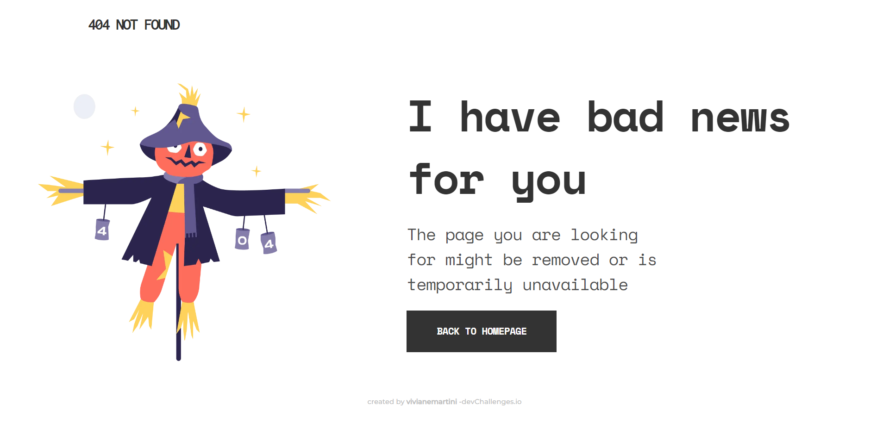

<!-- Please update value in the {}  -->

<h1 align="center">{404-not-found}</h1>

   Solution for a challenge from  <a href="http://devchallenges.io" target="_blank">Devchallenges.io</a>.

  <h3>
    <a href="https://vivianemartini.github.io/404-not-found.github.io/">
      Demo
    </a>
     | 
    <a href="https://devchallenges.io/solutions/zogacp5SOb7UTUHRbQ7p">
      Solution
    </a>
     | 
    <a href="https://devchallenges.io/challenges/wBunSb7FPrIepJZAg0sY">
      Challenge
    </a>
  </h3>

<!-- TABLE OF CONTENTS -->

## Table of Contents

- [Overview](#overview)
  - [Built With](#built-with)
- [Features](#features)
- [Contact](#contact)

<!-- OVERVIEW -->

## Overview

This project was perfect to practice CSS and create a responsive web page

### Built With

HTML5
CSS

## Features

This application/site was created as a submission to a DevChallenges challenge. The challenge was to build an application to complete the given user stories.

## Contact

- GitHub [@vivianemartini](https://github.com/vivianemartini})

